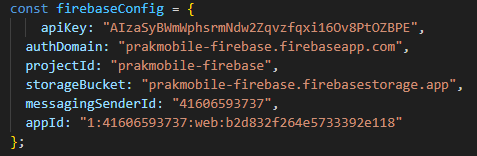
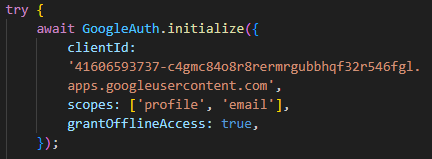
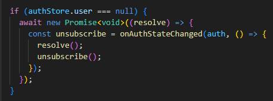
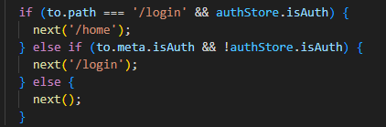
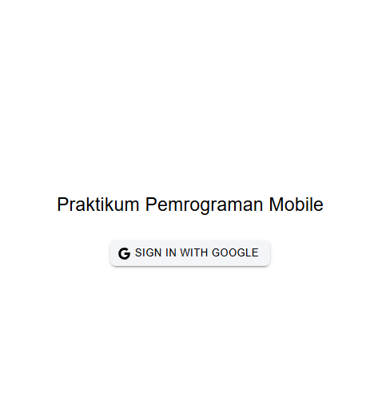
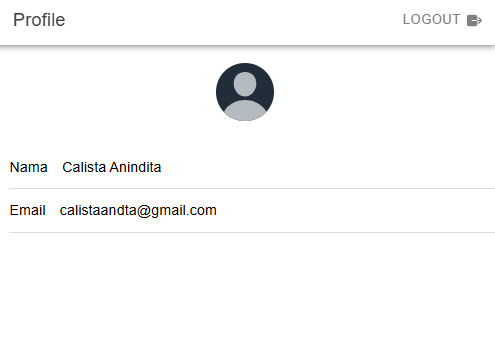
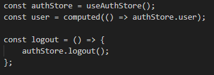

Penjelasan mengenai cara kerja autentikasi login menggunakan firebase hingga aplikasi mendapatkan username dan profil kita dari akun google

1.  Melakukan inisialisasi pada file src/utils/firebase.ts
    # import { initializeApp } from "firebase/app": menginisialisasi bahwa aplikasi menggunakan layanan Firebase.
    # import { getAuth, GoogleAuthProvider } from 'firebase/auth': memungkinkan aplikasi untuk mengelola login/logout menggunakan provider Google.
    # : berisi informasi yang menghubungkan aplikasi dengan proyek Firebase yang sesuai.
    
2.  Melakukan proses autentikasi melalui file src/stores/auth.ts
    # export const useAuthStore = defineStore('auth', () =>{ : mengelola status autentikasi pengguna secara global dengan nama store adalah auth.
    # const user = ref<User | null>(null): menyimpan data pengguna yang sedang login dan jika null berarti tidak ada pengguna yang login.
    # const isAuth = computed(() => user.value !== null): mengembalikan true jika pengguna sedang login.
    # : mengonfigurasi client ID dan scope (profile dan email) untuk mendapatkan data pengguna.
    # const googleUser = await GoogleAuth.signIn(): memulai proses login dan mengembalikan data pengguna (termasuk ID token).
    # const result = await signInWithCredential(auth, credential): memvalidasi ID token dan membuat/memverifikasi akun pengguna di Firebase.
    # user.value = result.user: data pengguna yang berhasil login akan disimpan di variabel user.
    # router.push("/home"): etelah login berhasil pengguna diarahkan ke halaman /home.
    
3.  Melakukan inisialisasi route pada file src/router/index.ts
    # const routes: Array<RouteRecordRaw>: berisi router-router untuk mengakses halaman.
    # : jika authStore.user masih null, tunggu sampai Firebase menyelesaikan pemeriksaan status autentikasi menggunakan onAuthStateChanged. Fungsi ini memastikan status login diperbarui sebelum navigasi ke rute.
    # : apabila pengguna sudah login akan diarahkan ke halaman home dan jika belum akan kembali diarahkan ke halaman login.

4.  Menampilkan halaman login menggunakan file LoginPage.vue
    
    # ion-button @click="login": tombol untuk memulai proses login
    # await authStore.loginWithGoogle(): menangani proses autentikasi dengan Google yang menggunakan clientId untuk mengakses API Google.
    # GoogleAuth.signIn(): untuk memulai login melalui Google 

5.  Menampilkan halaman profile menggunakan file ProfilePage.vue
    
    # value="user?.displayName": menampilkan nama pengguna yang login menggunakan Google.
    # value="user?.email": menampilkan email pengguna yang login menggunakan Google.
    # : data pengguna diambil dari store (authStore.user) dan diakses secara reaktif menggunakan computed.
