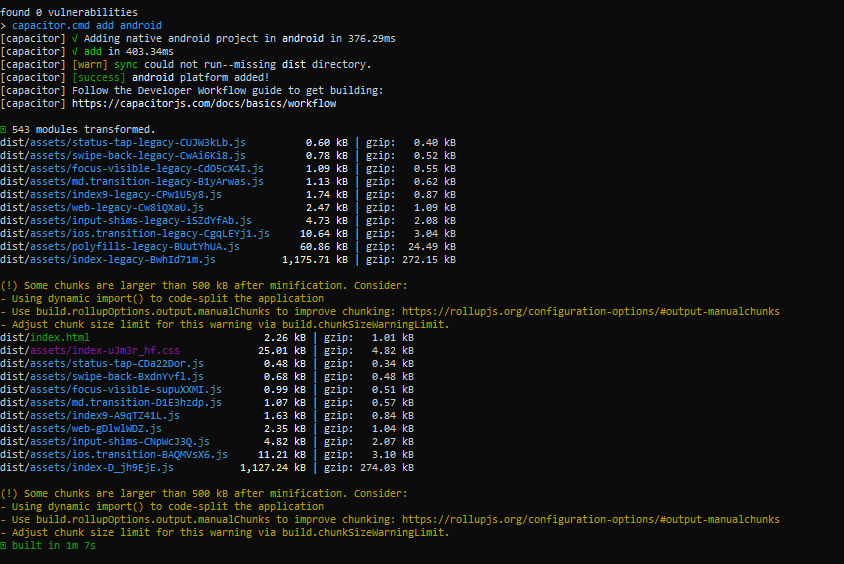
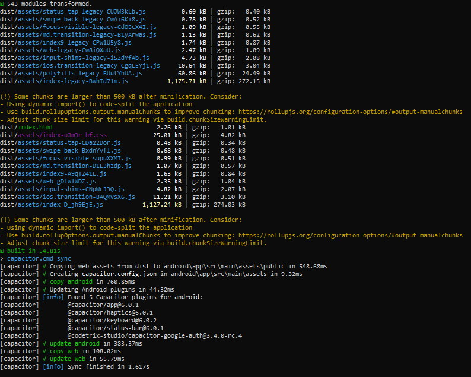

Tugas 9 Pertemuan 10

Penjelasan mengenai cara kerja autentikasi login menggunakan firebase hingga aplikasi mendapatkan username dan profil kita dari akun google

1.  Melakukan inisialisasi pada file src/utils/firebase.ts
    ** import { initializeApp } from "firebase/app": menginisialisasi bahwa aplikasi menggunakan layanan Firebase.
    ** import { getAuth, GoogleAuthProvider } from 'firebase/auth': memungkinkan aplikasi untuk mengelola login/logout menggunakan provider Google.
    ** : berisi informasi yang menghubungkan aplikasi dengan proyek Firebase yang sesuai.
    
2.  Melakukan proses autentikasi melalui file src/stores/auth.ts
    ** export const useAuthStore = defineStore('auth', () =>{ : mengelola status autentikasi pengguna secara global dengan nama store adalah auth.
    ** const user = ref<User | null>(null): menyimpan data pengguna yang sedang login dan jika null berarti tidak ada pengguna yang login.
    ** const isAuth = computed(() => user.value !== null): mengembalikan true jika pengguna sedang login.
    ** : mengonfigurasi client ID dan scope (profile dan email) untuk mendapatkan data pengguna.
    ** const googleUser = await GoogleAuth.signIn(): memulai proses login dan mengembalikan data pengguna (termasuk ID token).
    ** const result = await signInWithCredential(auth, credential): memvalidasi ID token dan membuat/memverifikasi akun pengguna di Firebase.
    ** user.value = result.user: data pengguna yang berhasil login akan disimpan di variabel user.
    ** router.push("/home"): etelah login berhasil pengguna diarahkan ke halaman /home.
    
3.  Melakukan inisialisasi route pada file src/router/index.ts
    ** const routes: Array<RouteRecordRaw>: berisi router-router untuk mengakses halaman.
    ** : jika authStore.user masih null, tunggu sampai Firebase menyelesaikan pemeriksaan status autentikasi menggunakan onAuthStateChanged. Fungsi ini memastikan status login diperbarui sebelum navigasi ke rute.
    ** : apabila pengguna sudah login akan diarahkan ke halaman home dan jika belum akan kembali diarahkan ke halaman login.

4.  Menampilkan halaman login menggunakan file LoginPage.vue
    
    ** ion-button @click="login": tombol untuk memulai proses login
    ** await authStore.loginWithGoogle(): menangani proses autentikasi dengan Google yang menggunakan clientId untuk mengakses API Google.
    ** GoogleAuth.signIn(): untuk memulai login melalui Google 

5.  Menampilkan halaman profile menggunakan file ProfilePage.vue
    
    ** value="user?.displayName": menampilkan nama pengguna yang login menggunakan Google.
    ** value="user?.email": menampilkan email pengguna yang login menggunakan Google.
    ** : data pengguna diambil dari store (authStore.user) dan diakses secara reaktif menggunakan computed.

========================================================================================================================

Tugas 10 Pertemuan 11

CRUD ToDo

1.  Create ToDo
    ** const todoRef = this.getTodoRef(): mendapatkan referensi ke koleksi todo yang dimiliki pengguna.
    ** addDoc(): method yang ada pada firebase firestore yang digunakan untuk menambahkan dokumen ke koleksi.
    ** ...todo: menambahkan properti yang diterima dari parameter todo.
    ** return docRef.id: mengembalikan ID dari dokumen baru yang dibuat.
    ** 

2.  Read ToDo
    ** const q = query(todoRef, orderBy('updatedAt', 'desc')): query untuk mengurutkan hasil berdasarkan waktu pembaruan (descending).
    ** const snapshot = await getDocs(q): query untuk mendapatkan dokumen-dokumen dari koleksi.
    ** id: doc.id: menambahkan id dokumen ke data menggunakan doc.id.
    ** 

3.  Update ToDo
    ** const docRef = doc(todoRef, id): untuk mendapatkan dokumen tertentu dalam koleksi berdasarkan id.
    ** updateDoc(): untuk memperbarui dokumen.
    ** ...todo: data yang akan diperbarui.
    ** 
    ** 

4.  Delete ToDo
    ** await deleteDoc(docRef): menghapus dokumen dari Firestore.
    ** 

Langkah-Langkah Build Ionic Ke Dalam Bentuk Apk

1.  ionic build
    

2.  ionic cap sync
    

3.  ionic cap open android
    

4.  Build Variant
    

5.  Build APK(s)
    

6.  File APK
    